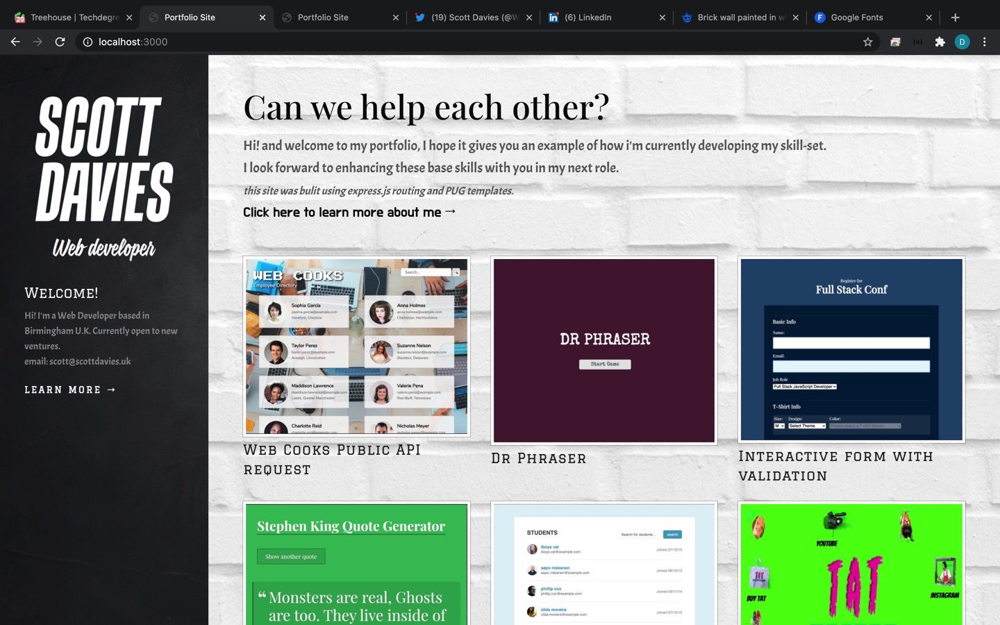

# TechDegree-Project-6

## Express JS Portfolio



## Live Demo

http://www.scottdavies.uk

## Getting Started

To get up and running with this project, run the following commands from the root of the folder that contains this README file.

First, install the project's dependencies using `npm`.

```
npm install
```

And start the application.

```
npm start
```

This will then run on 

[http://localhost:3000/](http://localhost:3000/).

